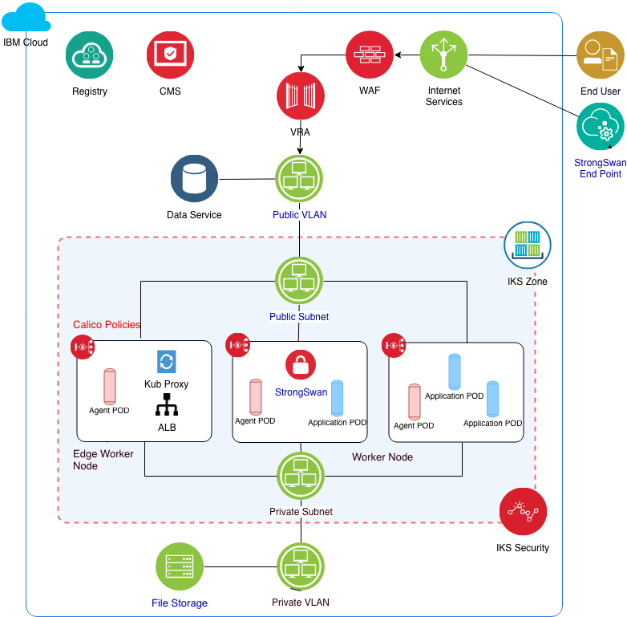

# Security

The Security aspect describes the security services and configuration to meet environment isolation, network segregation and application security.

---

## Architecture Diagram

## Security infrastructure code

- [Calico policies](../infrastructure_code/calico)

- [Configure Calico.tf](../infrastructure_code/terraform/config_calico.tf)

- [Configure Calico.sh](../infrastructure_code/configuration/configure-calico.sh)

- [Kubernetes secret for database](../infrastructure_code/configuration/create-cloudant-secret.sh)

## Security components and use

- [IBM Cloud Internet Services (CIS)](https://console.bluemix.net/docs/infrastructure/cis/getting-started.html#getting-started-with-ibm-cloud-internet-services-cis):  This service provides network and security capabilities including authoritative DNS servers, global and local load balancing, [Web Application Firewall (WAF)](https://cloud.ibm.com/docs/infrastructure/cis/waf-concept.html#web-application-firewall-concepts-q-a), [DDoS Protection](https://cloud.ibm.com/docs/infrastructure/cis/ddos-concept.html#distributed-denial-of-service-ddos-attack-concepts), and [page rules with caching](https://cloud.ibm.com/docs/infrastructure/cis/caching-with-page-rules.html#use-page-rules-with-caching). Recommended practices for using the CIS services considered in this solution include:

  - Secure your [origin IP addresses](https://cloud.ibm.com/docs/infrastructure/cis/managing-for-security.html#best-practice-1-secure-your-origin-ip-addresses) - when a subdomain is proxied using [IBM CIS](https://console.bluemix.net/docs/infrastructure/cis/getting-started.html#getting-started-with-ibm-cloud-internet-services-cis), all traffic is protected because we actively respond with IP addresses specific to IBM CIS (e.g. all of your clients connect to CIS proxies first, and your origin IP addresses are obscured).

  - Configure your [security level selectively](https://cloud.ibm.com/docs/infrastructure/cis/managing-for-security.html#best-practice-2-configure-your-security-level-selectively) - your security level establishes the sensitivity of our IP Reputation Database. To prevent negative interactions or false positives, configure your security level by domain to heighten security where necessary, and decrease it where appropriate.

  - Use the [WAF firewall](https://cloud.ibm.com/docs/infrastructure/cis/managing-for-security.html#best-practice-3-activate-your-web-application-firewall-waf-safely) - this solution uses the available CIS WAF for SQL injection attack, cross-site scripting and cross-site forgery. The solution uses the default rule library. The service is updated automatically to handle new vulnerabilities as they are identified.

  - [Configure TLS settings](https://cloud.ibm.com/docs/infrastructure/cis/managing-for-security.html#best-practice-4-configure-your-tls-settings) - IBM CIS provides options for encrypting your traffic. As a reverse proxy, it closes TLS connections at IBM data centers and opens a new TLS connection to your origin server.

- [Certificate Manager (CM)](https://console.bluemix.net/docs/services/certificate-manager/index.html#gettingstarted): The CM service helps you to store and manage SSL certificates that will be used with your IKS based applications. The service integrates with activity tracking to  track how users and applications interact with the CM service. In this solution, the automated deployment access the CM service to assign the certificate to the cluster.

- [Virtual Router Appliance (VRA) & Firewalls](https://console.bluemix.net/docs/infrastructure/fortigate-10g/explore-firewalls.html#explore-firewalls): IBM Cloud provides options for selecting the appropriate service for routing, network segmentation and IDS/IPS security. IBM Cloud provides a selection of routing and security services you can use to extend this reference solution. You may also use  [Security Groups](https://console.bluemix.net/docs/infrastructure/security-groups/sg_index.html#getting-started-with-security-groups) for virtual servers running workloads outside of the IKS cluster. You can explore all the [firewall options](https://console.bluemix.net/docs/infrastructure/fortigate-10g/explore-firewalls.html#explore-firewalls) available in IBM Cloud.

- [Calico](https://console.bluemix.net/docs/containers/cs_network_policy.html#cli_install):  Calico policies may be defined centrally and applied to each cluster's worker nodes. Calico CAN be used independently or in conjunction with one or more of virtual/physical routing/firewall services noted above.  This solution uses Calico policies that dynamically whitelist worker nodes during environment deployment to enable cluster communication. You may also opt to limit the worker nodes that are allowed to communicate on the public network as [edge nodes](https://console.bluemix.net/docs/containers/cs_edge.html#edge). 

  - In this example, Calico policies are applied similarly to all worker nodes to limit communications on both private and public networks. Another option would be to identify specific worker nodes as "edge nodes" that will communicate on the public and private networks. ALB/ingress controller will be deployed to these nodes. If you are using [*Itsio*](https://www.ibm.com/cloud/info/istio), edge services will also be deployed to these nodes. All other non-edge worker nodes will be limited to only private network communications except for Master node communications.

- [IKS cluster security](https://console.bluemix.net/docs/containers/cs_secure.html#security): This includes multiple levels of protection for IKS service API server, worker nodes, network, persistent storage, monitoring and logging, container images and registry, container isolation and security, and user personal information.

- [Container Registry](https://console.bluemix.net/docs/services/Registry/index.html#index):  This solution uses the Container Registry, a multi-tenant private image registry, to safely store and share your Docker images within your IBM Cloud account. It includes a [vulnerability advisor](https://console.bluemix.net/docs/services/va/va_index.html#va_index) that enables you to perform several security functions including scanning, reporting, recommendations and exemptions features.
