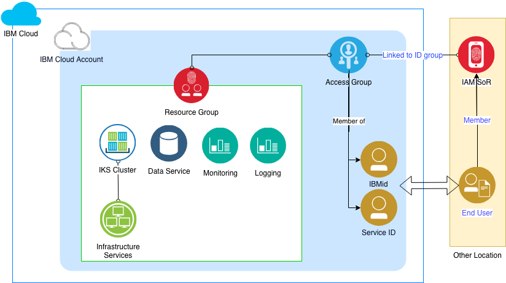

# Account Management

This aspect describes the account, group and user model to allow and control access and changes to your IKS environments.

---

## Access Control

Create a [resource group](https://console.bluemix.net/docs/resources/resourcegroups.html#rgs) to organize the IAM enabled IKS and data services for an environment in which you want to control user access.  When creating the IAM enabled IKS and data services, assign it to that resource group.
Use an [access group](https://console.bluemix.net/docs/iam/bp_access.html#access-group-setup) to assign user members and assign access policies and apply it to the resource group that defines the environment's resources.  Details on the [IAM model](https://console.bluemix.net/docs/iam/index.html#iamoverview) can be obtained in IBM Cloud Docs.  There you will also find the [Best Practices for assigning access](https://console.bluemix.net/docs/iam/bp_access.html#account_setup).

In this example, these processes are automated. The scripts require proper permissions to perform the provisioning.  More information the permissions for provisioning can be found on the DevOps Aspects page under [Provision Permissions section](DevOps.md/provisioner-permissions). 

[Additional guidance](https://console.bluemix.net/docs/iam/infrastructureaccess.html#infrapermission) on assigning permissions for billing, support cases, resources and deploying resources is contained in IBM Cloud Docs.

---

### Infrastructure Code

- [Resource group and Org](../infrastructure_code/terraform/persistent_svcs/resource_group.tf)

---

### Account Management Model

