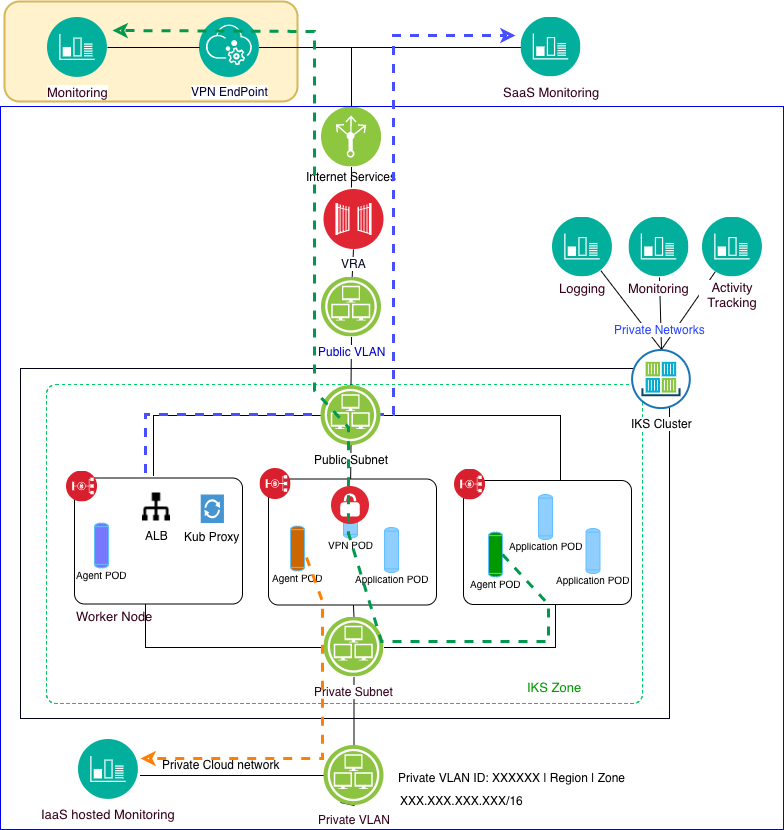

# Service Management

This aspect describes the architecture to support monitoring the IBM Kubernetes Service environment resources using agent-based monitoring and environment scanning.

---

## Manage Architecture

---

## Monitoring hosted in other locations (Green path)

You may choose to host your monitoring, scanning or other services in another location that will securely communicate with  applications or agents running in your IKS cluster (noted by the green path). In this case, you can use one of IBM Cloud VPN services to connect the cluster's resources to that location's networks. You can connect your worker nodes and apps to another location using a VPN IPSec endpoint with the strongSwan service, a Virtual Router Appliance, or a Fortigate Security Appliance. In this example, we selected the [strongSwan  service](https://cloud.ibm.com/docs/containers/cs_vpn.html#vpn_upgrade). Use a Helm chart to configure and deploy the strongSwan IPSec VPN service inside of a Kubernetes pod.

Since IKS is a fully managed service, you will want to run your containerized monitoring agents in your cluster as [DaemonSets](https://kubernetes.io/docs/concepts/workloads/controllers/daemonset/). The strongSwan service also provides for NAT to/from the end point and the cluster subnet. You can use NAT to remap the cluster's private local IP subnets, the pod subnet (172.30.0.0/16), or the pod service subnet (172.21.0.0/16) to a different private subnet. Additional details are in [IBM Cloud Docs](https://cloud.ibm.com/docs/containers/cs_vpn.html#vpn).

## SaaS-based monitoring (Blue path)

You may choose to use SaaS-based monitoring services that will connect with agents running in your cluster via the internet using secure communications (e.g. TLS/HTTP). In this case, you can run your containerized agents as noted above. Communications by each agent will follow the standard communication paths between worker and edge nodes and the Internet.

## IaaS hosted monitoring services (Orange path)

You may choose to install monitoring services/systems on IBM Cloud IaaS resources and connect agents running in your cluster to those services over private networks. In this case, the resources containing your monitoring service must only be deployed into the same account and be connected to a private VLAN. The multi-zone architecture necessitates [VLAN spanning](https://cloud.ibm.com/docs/infrastructure/vlans/vlan-spanning.html#vlan-spanning) which will provide for the communications between the monitoring services and the cluster networks. If you use a single zone cluster, then generally the monitoring services should be connected to the private VLAN used by the cluster.

## IBM Cloud Services

- IBM Cloud Monitoring: In this solution, we include automation to provision and configure the [IBM Cloud Monitoring with SysDig](https://cloud.ibm.com/docs/services/Monitoring-with-Sysdig/index.html#getting-started) This service is used to monitor several resource types in your IKS cluster. The agents capture container CPU and memory, pod network, worker node disk, load, memory, network, and monitoring service. See the IBM Cloud Docs for [details on using the monitoring service with IKS](https://cloud.ibm.com/docs/services/Monitoring-with-Sysdig/tutorials/kubernetes_cluster.html#kubernetes_cluster).

- IBM Cloud Logging: In this solution, we provide the scripts to provision and configure the [IBM Log Analysis with LogDNA Service](https://cloud.ibm.com/docs/services/Log-Analysis-with-LogDNA/index.html#getting-started). The service is used to store and analyze container logs and Kubernetes cluster logs that are collected automatically by the Kubernetes Service. IKS provides the capability to configure your cluster to forward container, application, worker node, Kubernetes system component and ingress controller logs to the Log Analysis service. [Details for using this service with IKS](https://cloud.ibm.com/docs/services/Log-Analysis-with-LogDNA/tutorials/kube.html#kube) are located in the Cloud Docs.

- IBM Activity Tracking: You can also use the [IBM Activity Tracking Service](https://cloud.ibm.com/docs/containers/cs_at_events.html#at_events) to track IKS and IBM Cloud container registry activities including cluster management events, API server audit events and events generated when interacting with the IBM Cloud Container Registry.	[Details for tracking registry events](https://cloud.ibm.com/docs/services/Registry/registry_at_events.html#at_events) are located in the Cloud Docs.
