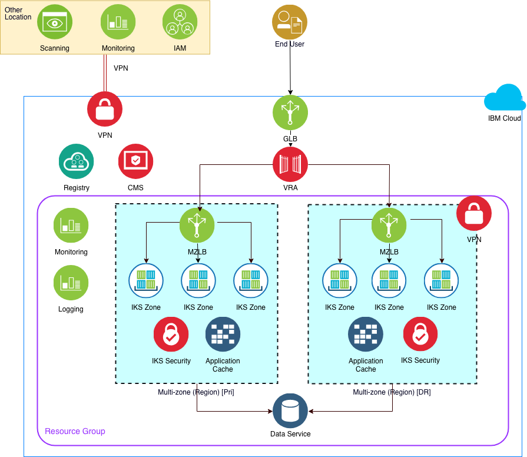

# IBM Kubernetes Service Infrastructure Architecture

## Solution Description

This reference solution describes the services, aspects and best practices for a highly available, secured and managed Kubernetes based environment using the [IBM Kubernetes Service](https://console.bluemix.net/docs/containers/container_index.html#container_index) and the [Terraform scripts](infrastructure_code/terraform) your team can use to immediately deploy and explore. The solution is ideal to use for relocating, refactoring or running your modularized Docker-based applications in IBM Cloud.  This solution describes and provides the scripts for Security, Networking, User Management, Compute and Service Management.

---

---

## Architecture aspects

This reference solution provides the design, documentation and *infrastructure code* using cross-cutting aspects to explains to different stakeholders how this solution implements the answers to the business challenges. The aspects are outlined below and align to the infrastructure code also maintaied in this repository. The Architecture aspects for this solution include:

- [Infrastructure](Aspects/Infrastructure.md): Describes the infrastructure services used in this solution.

- [Security](Aspects/Security.md): Describes the security services and configuration to meet environment isolation, network segregation and application security used in this solution.

- [Account Management](Aspects/accountmanagement.md): Describes the account, access/resource group, organization and user/role model used in this solution to control changes to the IKS environments.

- [Networking](Aspects/Networking.md): Describes the global, regional (multi-zone) and zone network architectures used for this solution.

- [Service Management](Aspects/servicemanagement.md): Describes the architecture for using agent-based monitoring and environment scanning of the resources in this solution.

- [DevOps](Aspects/DevOps.md): Describes the information and parameter values needed to run the infrastructure code.

## Deploy the solution

1. Use the [IBM Cloud infrastructure tutorial](https://www.ibm.com/cloud/garage/tutorials/public-cloud-infrastructure) to acquaint yourself with Terraform, the IBM Cloud Provider for Terraform, and the Docker Hub file.  Use them to set up an environment on your desktop or in a Kubernetes cluster to deploy this solution.

2. Clone this repository into your [Docker/Terraform run time](infrastructure_code/DockerFile) environment.

3. Review the [DevOps aspect](Aspects/DevOps.md) to select the services you will included in your deployment.  

4. Edit the variables in the [terraform.tvars](infrastructure_code/terraform/terraform.tfvars) file and replace with your values.

5. Run Terraform plan to validate then Terraform apply to provision your architecture. (see the tutorial for how to)
